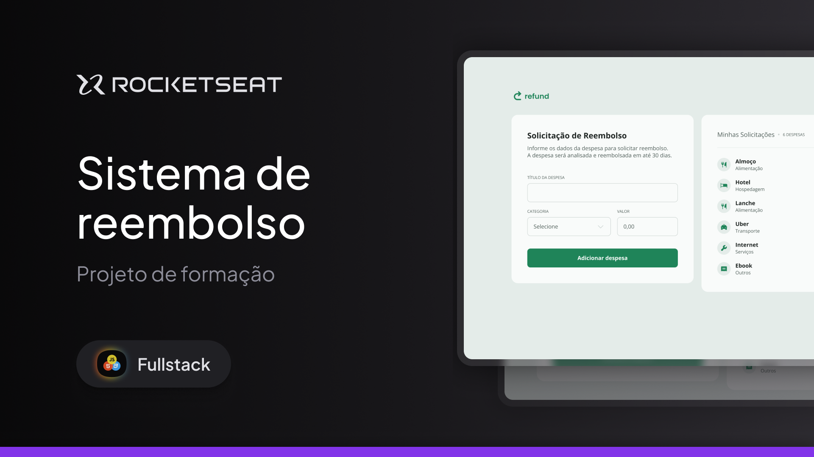

# Projeto Refund

  
    

## Sobre:

Projeto desenvolvido durante a formação **Full Stack** da **Rocketseat**.

O Refund permite os usuários cadastrarem suas despesas com a finalidade de serem reembolsados depois pela empresa.

## Tecnologias:

- Figma;
- HTML e CSS;
- Javascript;

## Tópicos:

- Manipulação do DOM;
- Eventos;
- Funções;
- Tratamento de Strings;
- Tratamento de Erros;
- Trabalhando com Datas;
